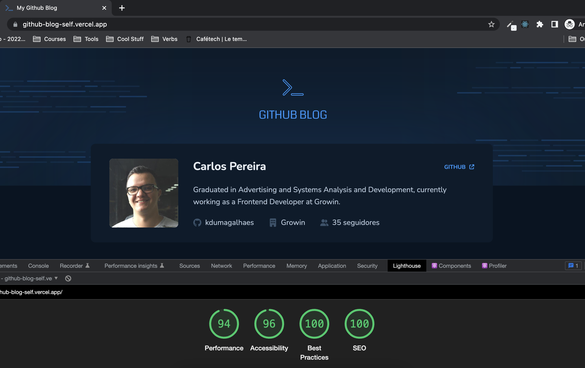

<h1 align="center">
    GitHub blog!
</h1>



<p align="center">
  
  <br />
  
  <br />
    
</p>

<p align="center">
    <a href="https://github-blog-self.vercel.app/" target="_blank">Click here to see the live demo!</a>&nbsp;&nbsp;&nbsp;
</p>

## Description
An application that uses the GitHub API to fetch issues from a repository, data from my user profile and display them as a blog. I used **SWR (Stale-While-Revalidate) techniques** to deliver a performatic experience to the user and **debounce techniques** to prevent unnecessary API calls and improve performance.
## User stories
- User can see a list of issues as blog articles;
- User can navigate into the articles;
- User can access the article details page clicking on a article card on the main page;
- User can search for articles using the search bar;

## How to install:

- git clone: https://github.com/kdumagalhaes/github-blog.git

```
npm install
```
```
npm run dev
```
## Requirements:
- Node's latest version installed on your machine.
- https://nodejs.org/en/download/

## Technologies

- [ReactJS](https://reactjs.org/)
- [Vite](https://vitejs.dev/)
- [TypeScript](https://www.typescriptlang.org/)
- [SWR](https://swr.vercel.app/pt-BR)
- [Styled Components](https://styled-components.com/)
- [React Router](https://reactrouter.com/en/main)
- [React MarkDown](https://github.com/remarkjs/react-markdown)
- [React Loader Spinner](https://www.npmjs.com/package/react-loader-spinner)
- [Context API](https://reactjs.org/docs/context.html)
- [Date fns](https://date-fns.org/)
- [GitHub REST API](https://docs.github.com/pt/rest?apiVersion=2022-11-28)
- [Fontawesome](https://fontawesome.com/v5/docs/web/use-with/react)

Made by [Carlos](https://www.linkedin.com/in/kdumagalhaes/) :wave:
